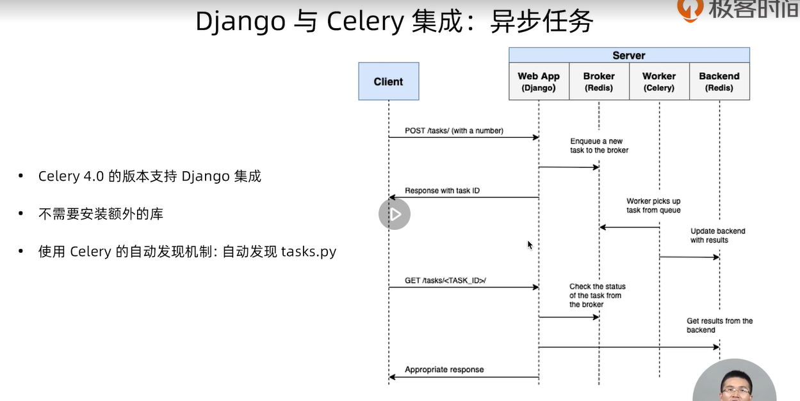
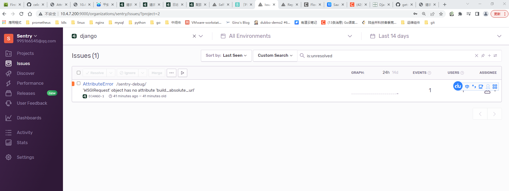

# Django进阶实战

## 一、为已有系统数据库生成管理平台

1.创建项目

```bash
django-admin startproject empmanager
```

2.修改setting.py

```python
# vim settings.py

DATABASES = {
    'default': {
        'ENGINE': 'django.db.backends.mysql',
        'NAME': 'poll',
        'USER': 'root',
        'PASSWORD': '123456',
        'HOST': '10.4.7.70',
        'PORT': '3306'
    }
}
```

3.创建一个应用

```bash
python3 manage.py startapp candidates
```

4.生成model类

```bash
python3 manage.py inspectdb > candidates/models.py
```

5.修改生成的models.py

```bash
修改models.py文件
```

6.启动django

```bash
python manager runserver 0.0.0.0:8000
```

## 二、定义自己的中间件

### 创建一个性能和日志中间件

```python
# 增加一个中间件函数
import time
import logging


logger = logging.getLogger(__name__)


def perfromance_logger_middle(get_response):
    def middleware(request):
        start_time = time.time()
        response = get_response(request)
        duration = time.time() - start_time
        response["X-page-Duration-ms"] = int(duration * 1000)
        logger.info("%s %s %s", duration, request.path, request.GET.dict())
        return response

    return middleware
```

将中间件添加到settings.py

```python
MIDDLEWARE = [
    'interview.performance.perfromance_logger_middle', # 新增
    'django.middleware.security.SecurityMiddleware',
    'django.contrib.sessions.middleware.SessionMiddleware',
    'django.middleware.common.CommonMiddleware',
    'django.middleware.csrf.CsrfViewMiddleware',
    'django.contrib.auth.middleware.AuthenticationMiddleware',
    'django.contrib.messages.middleware.MessageMiddleware',
    'django.middleware.clickjacking.XFrameOptionsMiddleware',
]
```

## django中settings配置

### LOGGING配置

<https://docs.djangoproject.com/zh-hans/3.2/topics/logging/>

```python
LOGGING = {
    'version': 1,
    'disable_existing_loggers': False,
    'formatters': {
        'simple': { # exact format is not important, this is the minimum information
            'format': '%(asctime)s %(name)-12s %(lineno)d %(levelname)-8s %(message)s',
        },
    },
    'handlers': {
        'console': {
            'class': 'logging.StreamHandler',
            'formatter': 'simple',
        },

        'mail_admins': { # Add Handler for mail_admins for `warning` and above
            'level': 'ERROR',
            'class': 'django.utils.log.AdminEmailHandler',
        },
        'file': {
            #'level': 'INFO',
            'class': 'logging.FileHandler',
            'formatter': 'simple',
            'filename': os.path.join(LOG_DIR, 'recruitment.admin.log'),
        },

        'performance': {
            #'level': 'INFO',
            'class': 'logging.FileHandler',
            'formatter': 'simple',
            'filename': os.path.join(LOG_DIR, 'recruitment.performance.log'),
        },
    },

    'root': {
        'handlers': ['console', 'file'],
        'level': 'INFO',
    },

    'loggers': {
        "django_python3_ldap": {
            "handlers": ["console", "file"],
            "level": "DEBUG",
        },

        "interview.performance": {
            "handlers": ["console", "performance"],
            "level": "INFO",
            "propagate": False,
        },
    },
}
```

## 多语言配置

## django-rest-framework

安装地址<https://www.django-rest-framework.org/#installation>

## django-redis

中文手册<https://django-redis-chs.readthedocs.io/zh_CN/latest/>

## 异步任务（celery集成）

官方网站<https://docs.celeryq.dev/en/stable/>
djcelery<https://github.com/celery/django-celery>

  什么是celery？

使用场景：

用户发起request，并等待response返回。在某些views中可能需要执行一段耗时的程序，那么用户就会等待很长时间，造成不好的用户体验，比如发邮件，手机验证码等。

```bash
什么是celery
```

### 使用celery后的请求流程



## 定时任务

安装依赖包

```bash
pip3 install django-celery-beat
```


### django集成celery示例

新创建的一个django工程目录结构如下，安装celery时，推荐的一种方式是创建一个新的/proj/proj/celery.py模块去创建Celery实例

```python
- recruitment/
  - manage.py
  - recruitment/
    - __init__.py
    - settings.py
    - urls.py
```

file: recruitment/recruitment/celery.py

```python
import os

from celery import Celery

# Set the default Django settings module for the 'celery' program.
os.environ.setdefault('DJANGO_SETTINGS_MODULE', 'recruitment.settings')

app = Celery('recruitment')

# Using a string here means the worker doesn't have to serialize
# the configuration object to child processes.
# - namespace='CELERY' means all celery-related configuration keys
#   should have a `CELERY_` prefix.
app.config_from_object('django.conf:settings', namespace='CELERY')

# Load task modules from all registered Django apps.
app.autodiscover_tasks()


@app.task(bind=True)
def debug_task(self):
    print(f'Request: {self.request!r}')
```

proj/proj/\_\_init\_\_.py:

```python
# This will make sure the app is always imported when
# Django starts so that shared_task will use this app.
from .celery import app as celery_app

__all__ = ('celery_app',)
```

### 启动celery

```bash
celery --app recruitment worker -l info
```

### 启动flower

```bash
celery -A recruitment flower
```

### celery配置项

<https://docs.celeryq.dev/en/stable/userguide/configuration.html#configuration>

示例：

```python
CELERY_BROKER_URL = 'redis://127.0.0.1:6379/4'
CELERY_RESULT_BACKEND = 'redis://127.0.0.1:6379/5'
CELERY_ACCEPT_CONTENT = ['application/json']
CELERY_RESULT_SERIALIZER = 'json'
CELERY_TASK_SERIALIZER = 'json'
CELERY_TIMEZONE = 'Asia/Shanghai'
CELERY_MAX_TASKS_PER_CHILD = 10
CELERYD_LOG_FILE = os.path.join(BASE_DIR, "logs", "celery_work.log")
CELERYBEAT_LOG_FILE = os.path.join(BASE_DIR, "logs", "celery_beat.log")
```

## sentry

文档地址：<https://docs.sentry.io/platforms/python/guides/django/http_errors/>
github：<https://github.com/getsentry/self-hosted>

### docker方式安装

#### 安装docker-compose

```bash
sudo curl -L "https://get.daocloud.io/docker/compose/releases/download/1.27.4/docker-compose-$(uname -s)-$(uname -m)" -o /usr/local/bin/docker-compose
```

### 下载软件并解压安装

```bash
[root@hdss7-200 sentry]# wget https://github.com/getsentry/onpremise/archive/20.8.0.zip
[root@hdss7-200 sentry]# unzip 20.8.0.zip
[root@hdss7-200 sentry]# cd self-hosted-20.8.0
[root@hdss7-200 sentry]# ./install.sh
```

### 启动sentry

```bash
docker-compose up -d
```

### 登录sentry



## 文件和图片上传功能


### 使用本地磁盘

## django模板

<https://docs.djangoproject.com/zh-hans/3.2/ref/templates/language/>

## Django常用插件

```bash
Django debug toolbar： 提供一个可以查看debug信息的面板(包括SQL执行时间，页面耗时)
网址: https://django-debug-toolbar.readthedocs.io/
django-silk：
Simple UI: 简单主题
网址：https://github.com/newpanjing/simpleui
HayStack Django: 提供全文搜索的功能
Django notifications
Django Markdown editor
django-crispy-forms： 
django-simple-captcha: django表单验证码
```

## 配置生产环境配置

+ DEBUG,在生产环境中设置为False。避免在web网页面现实敏感的调试跟踪和变量信息

+ SECRET_KEY.这个是用于CRSF保护的随机值

+ ALLOWED_HOSTS.生产环境必须配置，允许访问的域名

+ 生成SECRET_KEY python -c 'from django.core.management.utils import get_random_secret_key; print(get_random_secret_key())'

+ 从环境变量读取配置，活动配置文件中读取

````python
import os
DEBUG = FALSE
SECRET_KEY = os.environ.get('DJANGO_SECRET_KEY', 'xxxxxzzz')
ALLOWD_HOSTS = ['127.0.0.1', 'recruitment.ihopeio.com']
````

+ 从KMS系统中读取配置的密钥
1.自己部署的KMS系统
2.云服务的KMS服务，阿里云/AWS

## Django应用容器

### 同步应用

#### gunicorn

纯python实现的高性能pyhton应用容器，无外部依赖，简单容器配置；没有遇到性能问题的时候，推荐使用gunicorn

安装gunicorn

```bash
pip3 install gunicorn
gunicorn -w 3 -b 127.0.0.1:8000 recruitment.wsgi:application
```

#### uWSGI

### 异步应用

#### Daphne

#### Hypercorn

#### Uvicorn

```bash
pip3 install vnicorn
uvicorn --workers 3 --host 0.0.0.0 recruitment.asgi:application
```

## Django-prometheus

github: <https://github.com/korfuri/django-prometheus>

### 安装

```bash
pip3 install django-prometheus
```

## Django面试题

### django的生命周期

1. wsgi,请求封装后交给web 应用框架
2. 中间件，对请求进行校验或者在请求对象中添加其他相关数据
3. 路由匹配，根据浏览器发送的不同url去匹配不同的视图函数
4. 视图函数，在视图函数中进行业务逻辑的处理
5. 中间件，对响应的数据进行处理
6. wsgi, 将响应的内容发送给浏览器

### 列举django中间件的5个方法？以及django中间件的应用场景

1. process_request
    接收到客户端信息后立即执行，视图函数之前
2. process_response
    返回到客户端信息前最后执行，视图函数之后
3. process_view
    拿到视图函数的名称，参数，执行process_view方法
4. process_exception
    视图函数出错时执行
5. process_template_response
    在视图函数执行完后立即执行，前提是视图返回的对象中有一个render()方法

### django rest framework框架中都有哪些组件

1. 序列化组件：serializers对queryset序列化以及对请求数据可是校验
2. 路由组件router进行路由分发
3. 视图组件ModelViewSet帮助开发者提供了一些类，并在类中提供了多个方法
4. 认证组件
5. 权限组件
6. 频率组件
7. 解析器：选择对数据解析的类在解析器类中注册parser_classes
8. 渲染器：定义数据如何渲染到页面上，在渲染类中注册renderer_classes
9. 分页： 对获取到的数据进行分页处理，pagination_class
10. 版本：版本控制用来在不同的客户端使用不同的行为

### django rest framework框架中的视图都可以继承哪些类

class View(object)
class APIView(View)
class GenericAPIView(views.APIView)
    pass

class ModelViewSet(mixins.CreateModelMixin,
                   mixins.RetrieveModelMixin,
                   mixins.UpdateModelMixin,
                   mixins.DestroyModelMixin,
                   mixins.ListModelMixin,
                   GenericViewSet):
    pass

### 简述django rest framework框架的认证流程

### django rest framework如何实现用户访问频率控制

### DRF继承过哪些视图类，以及他们之间的关系

**第一种：** APIView遵循了CBV的模式，里面的功能比较多

**第二种：** ListAPIView，RetrieveAPIView，CreateAPIView，UpdateAPIView, DestroyAPIView

**第三种：** GenericViewSet、ListModelMixin,RetrieveModelMixin,CreateModelMixin,UpdateModelMixin,DestroyModelMixin。第三种则重构了APIView中的as_view()方法，结合请求方法和不同Mixin类的方法名从而进行执行不同的功能。与前面两种最主要的区别是url路由中as_view()方法中需要传值。