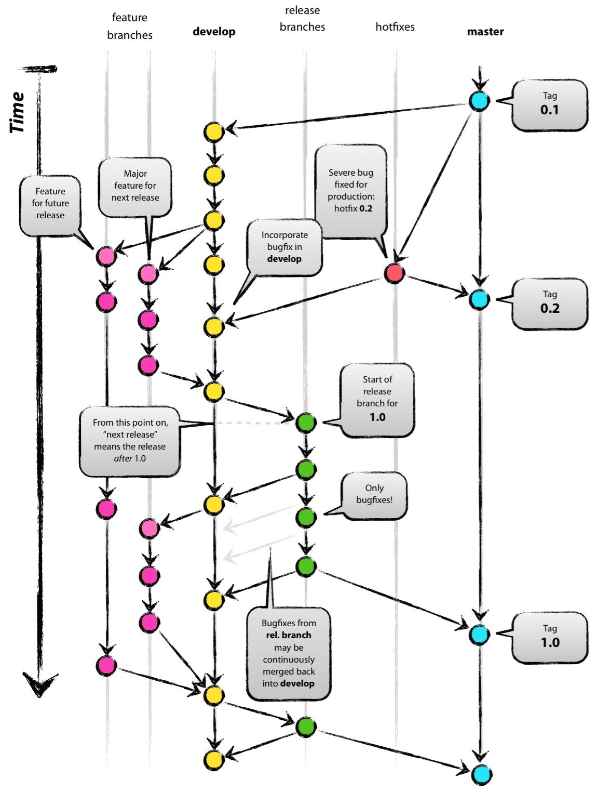
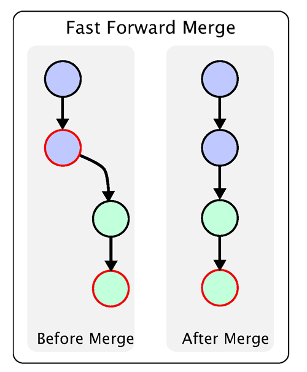

[toc]

# git操作

## 将某个分支的某个提交复制到另外一个分支

+ 使用git log命令找到commit的ID号，比如026d0203

+ 切换到目标分支上（即要合并的分支上），执行命令：

  ```
  git cherry-pick 026d0203
  ```

## git revert操作

git revert操作可以反做某一个版本，例如

```
git revert -n 8b89621019c9adc6fc4d242cd41daeb13aeb9861
```

可以将这个提交撤销，相当于手动回退代码

## git代码分支管理策略

### 主干开发分支分布

得到一个稳定版本后，将此稳定版本放到一个新分支上，针对此稳定版本的修修补补就在这个分支上进行，新功能不在此分支上开发，而在主干上开发进行新功能开发。这是业界采用较多的模式。

稳定分支上的有些修改，比如缺陷修复，需要合并到主干，但有些特定修改时不需要合并到主干的。这时需要千万注意合并准确的文件到主干。对于不能合并到主干的情况，常见的是再拉一个分支，这个分支专门为少数特定情况二用，但从全局讲，可能会导致太多分支，不同分支间混乱，所以并不推荐。推荐宁愿采用配置开关。

比如free bsd的发布就是一个典型的列子。

free bsd的主干永远是current，也就是包括最新特性的不稳定版本。然后随着新特性的逐步稳定，达到一个发布的里程碑以后，从主干分出来一个stable分支。freebsd是每个大版本一个分支。也就是说4.x，5.x，6,x各一个分支。每个发布分支上只有bug修改和现有功能的完善，而不会再增加新特性。新特性会继续在主干上开发。当稳定分支上发生的修改积累到一定程度以后，就会有一次发布。发布的时候会在稳定分支上再分出来一个 release分支。以6.x为例，就会有6.0,6.1,6.2…等发布分支。【此段摘自于网络 http://thinkernel.bokee.com/4518935.html 】

### 分支开发主干分布

得到一个稳定版本后，拉出先锋分支，在分支上开发新功能，在主干上进行修修补补。当先锋分支通过一定的测试之后，合并到主干。可以同时有多个先锋分支，不同的功能可以拉不同的分支，不同发布时间点而又要同时开发的内容必须在不同的分支上。

从发布的角度讲，更推荐将肯定一起发布的内容放在相同的先锋分支上。

主干上永远是稳定版本，可以随时发布。bug的修改和新功能的增加，全部在分支上进行。而且每个bug和新功能都有不同的开发分支，完全分离。而对主干上的每一次发布都做一个标签而不是分支。分支上的开发和测试完毕以后才合并到主干。

这种发布方法的好处是每次发布的内容调整起来比较容易。如果某个新功能或者bug在下一次发布之前无法完成，就不可能合并到主干，也就不会影响其他变更的发布。另外，每个分支的生命期比较短，唯一长期存在的就是主干，这样每次合并的风险很小。每次发布之前，只要比较主干上的最新版本和上一次发布的版本就能够知道这次发布的文件范围了。

【此段摘自于网络 http://thinkernel.bokee.com/4518935.html 】

### 一个成功的分支模型

1.存在一条主分支（master）。所有用户可见的正式版本，都从master发布。主分支作为稳定的唯一代码库，不做任何开发使用。

拉取源：无需。

合并目标：无需。

修改：不允许。

生命期：持续。

2.存在一条开发分支（develop）。这个分支维护了当前开发中代码的主线，始终保持代码新于master。持续集成、最新隔夜版本的生成等都是基于这个分支。由于当前版本迭代较快，开发分支只提供拉取，不进行实际开发。

拉取源：master。

合并目标：无需。

修改：不允许。

生命期：持续。

3.临时性多个功能分支（feature）。从develop拉取。开发feature完成，merge回develop。为了降低对其他feature的影响，一般在提测前merge回develop分支。

拉取源：develop。

合并目标：develop。

修改：允许。

生命期：合并后删除。

4.临时性多个预发布（测试）分支（release），用于QA测试。从develop拉取，测试完成merge回master和develop。如果测试期间，有其他版本合并入master，需要同步到release版本，并进行测试。

拉取源：develop。

合并目标：master & develop。

修改：允许。

生命期：合并后删除。

5. 临时性多个bug修复分支（fixbug），用于修复线上问题。从master拉取，修复并测试完成merge回master和develop。如果修复期间，有其他版本合并入master ，需要同步到fixbug版本，并进行测试。

拉取源：master。

合并目标：master，develop。

修改：允许。

生命期：合并后删除。



### 常用命令

```bash
# git创建develop分支的命令
git checkout -b develop master


# 将develop分支发布到master分支命令
git checkout master
git merge --no-ff develep
```

这里稍微解释一下，上一条命令的--no-ff参数是什么意思。默认情况下，Git执行"快进式合并"（fast-farward merge），会直接将Master分支指向Develop分支。



使用--no-ff参数后，会执行正常合并，在Master分支上生成一个新节点。为了保证版本演进的清晰，我们希望采用这种做法。关于合并的更多解释，请参考Benjamin Sandofsky的[《Understanding the Git Workflow》](https://sandofsky.com/blog/git-workflow.html)。


### 预发布分支

预发布分支，它是指发布正式版本之前（即合并到Master分支之前），我们可能需要有一个预发布的版本进行测试。

预发布分支是从Develop分支上面分出来的，预发布结束以后，必须合并进Develop和Master分支。它的命名，可以采用release-*的形式。

创建一个预发布分支：

```bash
git checkout -b release-1.2 develop
```

确认没有问题后，合并到master分支：

```bash
git checkout master
git merge --no-ff release-1.2
# 对合并生成的新节点，做一个标签
git tag -a 1.2
```

再合并到develop分支：

```bash
git checkout develop
git merge --no-ff release-1.2
```

最后，删除预发布分支：

```bash
git branch -d release-1.2
```

### 修补bug分支

最后一种是修补bug分支。软件正式发布以后，难免会出现bug，这时就需要创建一个分支，进行bug修复。

修补bug分支是从Master分支上面分出来的。修补结束以后，再合并进Master和Develop分支。它的命名，可以采用fixbug-*的形式。


创建一个修补bug分支：

> 　　git checkout -b fixbug-0.1 master

修补结束后，合并到master分支：

> 　　git checkout master
>
> 　　git merge --no-ff fixbug-0.1
>
> 　　git tag -a 0.1.1

再合并到develop分支：

> 　　git checkout develop
>
> 　　git merge --no-ff fixbug-0.1

最后，删除"修补bug分支"：

> 　　git branch -d fixbug-0.1


