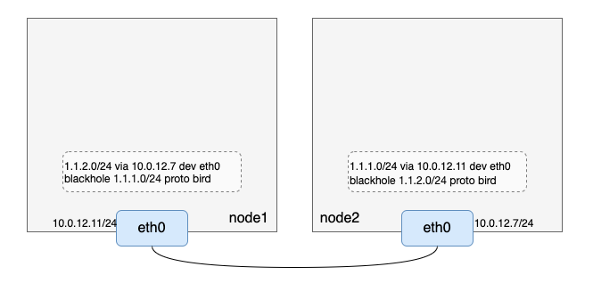
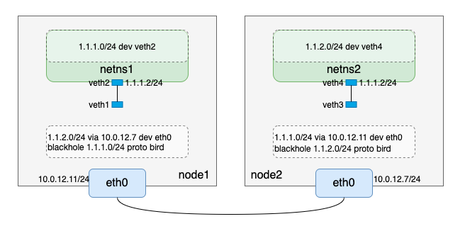
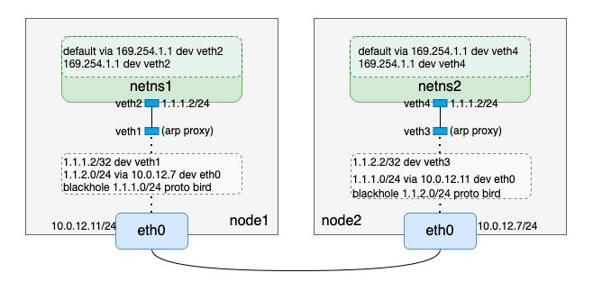

# calico原理及部署

## 组件介绍

+ **Felix:** Calico agent, 运行在每个Node上，负责为容器设置网络资源（IP地址、路由规则、iptabels规则等），保证跨主机容器网络互通。
+ **etcd：** Calico使用的后端存储。
+ **BGP Client：** 负责把Felix在各Node上设置的路由信息通过BGP协议广播到Calico网络。
+ **Route Reflector：** 通过一个或者多个BGP Route Reflector来完成大规模集群的分级路由分发。
+ **Calico：** calico命令行工具

## BGP

BGP全称是Border Gateway Protocol,即边界网关协议。
假设有以下两台主机可以BGP通信：


|  主机名 | 主机IP      | 负责容器IP网段|
----------|------------|-------------|
|  node1  | 10.4.7.60  |  1.1.1.0/24 |
|  node2  | 10.4.7.200 |  1.1.2.0/24 |

则node1发送给10.4.7.200的BGP信息可以看做：

```bash
[BGP信息]
我负责的容器网段是1.1.1.0/24
我的主机ip是10.4.7.60
```

则node2发送给10.4.7.60的BGP信息可以看做：

```bash
[BGP信息]
我负责的容器网段是1.1.2.0/24
我的主机ip是10.4.7.200
```

通过BGP通信，每个节点都能知道其它节点负责的容器网段以及对应的宿主机IP，这样就能配置类似flanneld host-gateway模式的路由，这就可以简单理解BGP在calico项目中的作用。

### bird

BGP是一种数据协议，发送和接收BGP类型的数据需要客户端程序，calico使用的BGP客户端程序是bird

安装bird

```bash
# 安装bird2
yum install bird2 -y
# 启动bird
systemctl enable bird
systemctl start bird
# 验证bird是否安装成功
birdc show route
BIRD 2.0.9 ready.
```

### 配置bird

不同主机间的bird的BGP通信是通过TCP完成的，因此需要在bird的配置文件中提前配置好对方的ip和端口，默认端口是179。 bird的默认配置文件是/etc/bird.conf。

修改10.4.7.60的配置文件/etc/bird.conf

```bash
[root@centos-7-60 ~]# cat /etc/bird.conf
router id 10.4.7.60;

protocol static {
  ipv4;

  route 1.1.1.0/24 blackhole;
}

filter calico_kernel_programming {
  accept;
}

protocol kernel {
  learn;             # Learn all alien routes from the kernel
  persist;           # Don't remove routes on bird shutdown
  scan time 2;       # Scan kernel routing table every 2 seconds
  ipv4 {
    import all;
    export all;
  };
  graceful restart;
  merge paths on;
}

protocol device {
  debug { states };
  scan time 2;    # Scan interfaces every 2 seconds
}

protocol direct {
  debug { states };
  interface -"veth*", "*"; # Exclude cali* and kube-ipvs* but
                                          # include everything else.  In
                                          # IPVS-mode, kube-proxy creates a
                                          # kube-ipvs0 interface. We exclude
                                          # kube-ipvs0 because this interface
                                          # gets an address for every in use
                                          # cluster IP. We use static routes
                                          # for when we legitimately want to
                                          # export cluster IPs.
}

function calico_aggr ()
{
      if ( net = 1.1.1.0/24 ) then { accept; }
      if ( net ~ 1.1.1.0/24 ) then { reject; }
}

filter calico_export_to_bgp_peers {
  calico_aggr();

  if ( net ~ 1.1.0.0/16 ) then {
    accept;
  }
  reject;
}

template bgp bgp_template {
  debug { states };
  description "Connection to BGP peer";
  local 10.4.7.60 as 50060;
  ipv4 {
    import all;
    export filter calico_export_to_bgp_peers;
  };
  graceful restart;
  connect delay time 2;
  connect retry time 5;
  error wait time 5,30;
}

protocol bgp Mesh_10_0_12_11 from bgp_template {
  neighbor 10.4.7.200 port 179 as 50200;
}
```

修改10.4.7.200的配置文件/etc/bird.conf

```bash
[root@hdss7-200 flannel-v0.18.1-linux-amd64]# cat /etc/bird.conf
router id 10.4.7.200;

protocol static {
  ipv4;

  route 1.1.2.0/24 blackhole;
}

filter calico_kernel_programming {
  accept;
}

protocol kernel {
  learn;             # Learn all alien routes from the kernel
  persist;           # Don't remove routes on bird shutdown
  scan time 2;       # Scan kernel routing table every 2 seconds
  ipv4 {
    import all;
    export all;
  };
  graceful restart;
  merge paths on;
}

protocol device {
  debug { states };
  scan time 2;    # Scan interfaces every 2 seconds
}

protocol direct {
  debug { states };
  interface -"veth*", "*"; # Exclude cali* and kube-ipvs* but
                                          # include everything else.  In
                                          # IPVS-mode, kube-proxy creates a
                                          # kube-ipvs0 interface. We exclude
                                          # kube-ipvs0 because this interface
                                          # gets an address for every in use
                                          # cluster IP. We use static routes
                                          # for when we legitimately want to
                                          # export cluster IPs.
}

function calico_aggr ()
{
      if ( net = 1.1.2.0/24 ) then { accept; }
      if ( net ~ 1.1.2.0/24 ) then { reject; }
}

filter calico_export_to_bgp_peers {
  calico_aggr();

  if ( net ~ 1.1.0.0/16 ) then {
    accept;
  }
  reject;
}

template bgp bgp_template {
  debug { states };
  description "Connection to BGP peer";
  local 10.4.7.200 as 50200;
  ipv4 {
    import all;
    export filter calico_export_to_bgp_peers;
  };
  graceful restart;
  connect delay time 2;
  connect retry time 5;
  error wait time 5,30;
}

protocol bgp Mesh_10_0_12_11 from bgp_template {
  neighbor 10.4.7.60 port 179 as 50060;
}
```

==配置文件需要注意的几个地方==

> 1. route id作为每个BGP client的唯一标识，不能重复，一般以主机IP命名
> 2. protocol static下有一条黑洞路由
> 3. protocol direct下有条 -"veth"的条目
> 4. function calico_aggr中配置的信息在本文中是要告知其它机器你负责的容器IP网段是什么；
> 5. filter calico_export_to_bgp_peers中1.1.0.0/16表示容器IP大网段范围；
> 6. template bgp bgp_template下，local $IP as $num条目中,填的是当前宿主机，num是作为信息校验的一个标识，需要在对方的配置中匹配上；
> 7. protocol bgp Mesh_10_0_12_7 from bgp_template下，neighbor $IP $port as $num条目中，IP填的是邻居的宿主机IP，填写默认的的端口，num则要与对方template bgp bgp_template的num（也就是上述第6点中的$num）对应上。

两个节点重启bird，查看路由

```bash
//node1 

// node2
[root@hdss7-200 flannel-v0.18.1-linux-amd64]# route -n
Kernel IP routing table
Destination     Gateway         Genmask         Flags Metric Ref    Use Iface
0.0.0.0         10.4.7.254      0.0.0.0         UG    100    0        0 ens33
1.1.1.0         10.4.7.60       255.255.255.0   UG    32     0        0 ens33
1.1.2.0         0.0.0.0         255.255.255.0   U     32     0        0 *
10.4.7.0        0.0.0.0         255.255.255.0   U     100    0        0 ens33
192.168.122.0   0.0.0.0         255.255.255.0   U     0      0        0 virbr0

[root@hdss7-200 flannel-v0.18.1-linux-amd64]# ip route
default via 10.4.7.254 dev ens33 proto static metric 100
1.1.1.0/24 via 10.4.7.60 dev ens33 proto bird metric 32  # 新增加的路由，对方容器IP网段
blackhole 1.1.2.0/24 proto bird metric 32                # 新增加的路由
10.4.7.0/24 dev ens33 proto kernel scope link src 10.4.7.200 metric 100
172.7.200.0/24 dev docker0 proto kernel scope link src 172.7.200.1
192.168.122.0/24 dev virbr0 proto kernel scope link src 192.168.122.1

```

可以看到bird重启后每台机器上多了两条路由，第一条是到本机负责容器IP网段的黑洞路由，第二条目的IP段是对方的容器IP段，网关是对方宿主机的ip；其中第二条路由是通过BGP通信，接收到对方发来的BGP信息计算生成的路由，这条路由和flanneld host-gateway模式生成的路由功能是一样的。

### BGP Router Reflector

### calico BGP模式的实现

通过前文配置和启动bird，我们当前有了如下环境信息


**创建netns、veth pair。** 接下来再把netns和veth pair补上

```bash
// node1
// node1
// 创建网络命名空间netns1
[root@VM-12-11-centos ~]# ip netns add netns1
// 创建虚拟网络设备对veth1-veth2
[root@VM-12-11-centos ~]# ip link add veth1 type veth peer name veth2
// 把veth2放入网络命名空间netns1
[root@VM-12-11-centos ~]# ip link set veth2 netns netns1
// 给veth2配置IP并up
[root@VM-12-11-centos ~]# ip netns exec netns1 ifconfig veth2 1.1.1.2/24 up
// 设备veth1 up
[root@VM-12-11-centos ~]# ifconfig veth1 up
// 查看netns1路由
[root@VM-12-11-centos ~]# ip netns exec netns1 route -n
Kernel IP routing table
Destination     Gateway         Genmask         Flags Metric Ref    Use Iface
1.1.1.0         0.0.0.0         255.255.255.0   U     0      0        0 veth2


// node2
// 创建网络命名空间netns2
[root@VM-12-7-centos ~]# ip netns add netns2
// 创建虚拟网络设备对veth3-veth4
[root@VM-12-7-centos ~]# ip link add veth3 type veth peer name veth4
// 把veth4放入网络命名空间netns2
[root@VM-12-7-centos ~]# ip link set veth4 netns netns2
// 给veth4配置IP并up
[root@VM-12-7-centos ~]# ip netns exec netns2 ifconfig veth4 1.1.2.2/24 up
// 设置veth3 up
[root@VM-12-7-centos ~]# ifconfig veth3 up
// 查看netns2路由
[root@VM-12-7-centos ~]# ip netns exec netns2 route -n
Kernel IP routing table
Destination     Gateway         Genmask         Flags Metric Ref    Use Iface
1.1.2.0         0.0.0.0         255.255.255.0   U     0      0        0 veth4
```

到这里，我们完成了如下逻辑



> 1. node1上的veth1和node2上的veth3,只是up状态但是没有配置IP；
> 2. node1上netns1网络命名空间的目的网段是1.1.1.0/24的路由，node2上netns2网络命名空间只有目的网段是1.1.2.0/24的路由

通过上述环境准备，我们发现创建的网络命名空间内无法访问非本宿主机维护外的容器网段IP，例如node1上netns1无法访问1.1.2.0/24,因为该网络命名空间内没有对应的路由。这里calico用到了arp proxy.

> **arp proxy**
> 
> calico为了简化网络配置，会在容器网络命名空间内添加一条网关是169.254.1.1,将容器内的路由都设置成一样，不需要动态更新。

### 重新配置出路由方向

``` bash
// node1
// netns1网络命名空间内先删除配置IP时自动生成的路由
[root@VM-12-11-centos ~]# ip netns exec netns1 ip route del 1.1.1.0/24
// 宿主机上开启veth1的arp proxy
[root@VM-12-11-centos ~]# echo 1 > /proc/sys/net/ipv4/conf/veth1/proxy_arp
// netns1网络命名空间内添加169.254.1.1路由
[root@VM-12-11-centos ~]# ip netns exec netns1 ip route add 169.254.1.1 dev veth2
// netns1网络命名空间内添加默认路由
[root@VM-12-11-centos ~]# ip netns exec netns1 ip route add default via 169.254.1.1 dev veth2
// 查看netns1网络命名空间路由
[root@VM-12-11-centos ~]# ip netns exec netns1 ip route
default via 169.254.1.1 dev veth2 
169.254.1.1 dev veth2 scope link 


// node2
// netns2网络命名空间内先删除配置IP时自动生成的路由
[root@VM-12-7-centos ~]# ip netns exec netns2 ip route del 1.1.2.0/24
// 宿主机上开启veth3的arp proxy
[root@VM-12-7-centos ~]# echo 1 > /proc/sys/net/ipv4/conf/veth3/proxy_arp
// netns2网络命名空间内添加169.254.1.1路由
[root@VM-12-7-centos ~]# ip netns exec netns2 ip route add 169.254.1.1 dev veth4
// netns2网络命名空间内添加默认路由
[root@VM-12-7-centos ~]# ip netns exec netns2 ip route add default via 169.254.1.1 dev veth4
// 查看netns2网络命名空间路由
[root@VM-12-7-centos ~]# ip netns exec netns2 ip route
default via 169.254.1.1 dev veth4 
169.254.1.1 dev veth4 scope link 
```

### 配置入路由方向

```bash
// node1
ip route add 1.1.1.2/32 dev veth1

// node2
ip route add 1.1.2.2/32 dev veth3
```

到此，完成了如下逻辑



### 黑洞路由

calico的bird会配置一条黑洞路由，例如node1上会有一条1.1.1.0/24 blackhole的黑洞路由，结合入方向的的路由(1.1.1.2/32 dev veth1)和路由的最长匹配原则，此时如果有大量请求访问1.1.1.0/24下的不存在的IP（非1.1.1.2）时，会路由到黑洞路由，这样能有效减少这些无效请求对系统负载的影响。

### 流程分析

理论加实践验证后，我们以 1.1.1.2 ping 1.1.2.2为例，梳理下从node1上网络命名空间netns1到node2上网络命名空间netns2的报文传输过程：

>1. 数据包在node1上netns1网络协议栈组装好，通过匹配默认路由default via 169.254.1.1 dev veth2，数据包从veth2发出；
>2. node1上从veth2出去的数据包到达veth pair的另一端；
>3. 数据包匹配bird生成的1.1.2.0/24 via 10.4.7.200 dev ens33路由，把数据包从ens33发出，到达下一跳10.4.7.200,也就是node2；
>4. node2上匹配路由1.1.2.2/32 dev veth3，数据包发往veth3；
>5. node2上veth3过来的数据包到达veth pair的另一端，netns2网络命名空间下的veth4；
>6. node2上vnetns2网络命名空间下的veth4发现1.1.2.2是自己，构造回程报文，从veth4发出；
>7. node2上veth4发出来的报文叨叨veth pair的另一端veth3；
>8. node2上到达veth3的报文匹配路由1.1.1.0/24 via 10.4.7.60/32 dev ens33, 从ens33发出到达node1
>9. node1上匹配1.1.1.2/32 dev veth1到达veth pair的一端veth1；
>10. node1上从veth1过来的包到达veth pair的另一端，即netns1网络命名空间下的veth2
> 11. node1上netns1网络命名空间下的veth2收到回程报文。

## calico的两种网络模式的对比

**IPIP:**
流量：tunl0设备封装数据，形成隧道，承载流量
适用网络类型：适用于互相访问的pod所在宿主机不在同一个网段，跨网段访问的场景，外层封装的ip能够解决跨网段的路由问题
效率：流量需要tunl0设备封装，效率略低

**BGP网络：**
流量：使用路由信息导向流量
适用网络类型：适用于访问的pod在同一个网段，适用于大型网络
效率：原生host-gw，效率高

## Calico网络优缺点分析

**优点：**

1. 在网络连接中性能高：calico配置第三层网络，该网络适用BGP路由协议在主机之间路由数据，不需要将数据包额外封装
2. 支持网络策略： 网络策略是其受追捧的功能之一。此外Calico还可以与服务网格lstio集成，以便在服务网格层和网络基础架构层中解释和实施集群内工作负载的策略，这意味着用户可以配置强大的规则，描述Pod应如何发送和接受流量，提高安全性并控制网络环境。

**缺点：**

1. 租户隔离问题： Calico 的三层方案是直接在 host 上进行路由寻址，那么对于多租户如果使用同一个pod网络就面临着地址冲突的问题。
2. 路由规模问题： 通过路由规则可以看出，路由规模和 pod 分布有关，如果 pod离散分布在host 集群中，势必会产生较多的路由项。
3. iptables规模问题：1台Host 上可能虚拟化十几或几十个容器实例，过多的 iptables 规则造成复杂性和不可调试性，同时也存在性能损耗。

## calico与flannel的异同点

区别

+ calico支持kuberntes的网络策略，flanneld不支持
+ calico使用了BGP协议，flannel通过路由方式实现的一种高性能容器跨主机通信方案
+ calico支持BGP模式，IPIP模式；flanneld支持host-gw模式，VxLan模式

网络性能分析，官方指标如下：
**flannel host-gw** = **flannel  vxlan-directrouting** = **calico bgp** > **calico ipip** > **flannel vxlan-vxlan** > **flannel-udp**
