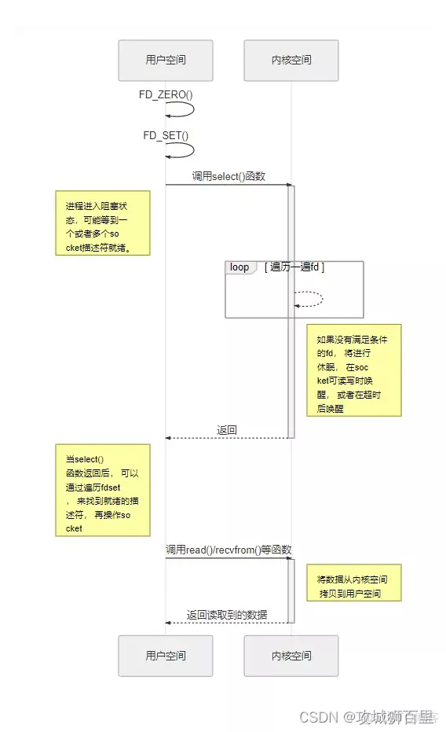

[TOC]


# Linux基础知识

## 磁盘Raid

https://blog.csdn.net/ensp1/article/details/81318135

### raid0

### raid5

### raid10

## IO多路复用

epoll和select都能够提供多路I/O复用的解决方案，在现在的Linux内核中都能够支持，其中epoll是Linux特有，而select则应该是POSIX所规定，一般操作系统均有实现

**I/O多路复用相当于 **将遍历所有文件描述符，通过非阻塞IO查看其是否就绪的** 的过程从用户线程移到了内核中，由内核来负责轮询。**

进程可以通过select，poll，epoll发现I/O多路复用的系统调用，这些系统调用都是同步阻塞的：如果传入的多个文件描述符中，有描述符就绪，则返回就绪的描述符；如果没有文件描述符就绪，就阻塞调用进程，直到某个文件描述符就绪；或者阻塞时长超过设置的timeout值，再返回。

如果timeout参数设置NULL，会无限阻塞直到某个描述符就绪；如果timeout设置为0，就立即返回，不阻塞。

|              |   select         |  poll       |  epoll      |
|--------------|------------------|-------------|-------------
|  性能        | 随着连接数的，处理成千上万的并发连接时，性能很差           | 随着连接数的增加，性能急剧下降，处理成千上万的并发连接时，性能很差        | 随着连接数的增加，性能基本没有变化 |
|  连接数       | 一般1024         | 无限制     | 无限制     |
|  内存拷贝     | 每次调用select拷贝| 每次调用poll拷贝| fd首次调用epoll_ctl拷贝，每次调用epoll_wait不拷贝 |
|  数据结构     | bitmap           | 数组        | 红黑树  |
|  内在处理机制 |  线性轮询         | 线性轮询     | FD挂载红黑树，通过事件回调callback |
|  时间复杂度   | O(n)             | O(n)        | O(1)     |


### select 

执行流程


+ 用户线程调用select，将fd_set从用户空间拷贝到内核空间
+ 内核在内核空间对fd_set遍历一遍，检查是否有就绪的socket描述符，如果没有的话，就会进入休眠，一直到有就绪的socket描述符或者达到超时时间
+ 内核返回select的结果到用户线程，就绪的文件描述符数量
+ 用户拿到就绪的文件描述符数据结构后，再次对fd_set进行遍历，找出就绪的socket描述符
+ 用户线程对就绪的文件描述符执行读写操作

优点：

1. 跨平台，几乎所有的平台都支持
2. 时间精度高ns级别

缺点：

1. 最大限制： 单个进程能够监视的socket文件描述符数量存在最大限制，具体数目通过cat /proc/sys/fs/file-max查看。他由FD_SIZESET, 32位机默认1024。64位机默认2048
2. 对socket进行扫描是线性的，采用轮询的方式，效率较低。

    当套接字比较多的时候，每次select()系统调用都要通过遍历FD_SET SIZE个socket来完成调度，不管哪个socket都是活跃的，都遍历一遍。这会浪费很多CPU时间。如果能给某个套接字注册某个回调函数，当他们活跃时，自动完成相关操作，那就避免了轮询，这正是epoll和poll所作的。

3. 内存拷贝：护一个用来存放大量fd的数据结构，这样会使得用户空间和内核空间在传递该结构时复制开销大

select 本质是通过设置或者检查存放fd标志位的数据结构进行下一步处理

### poll

poll本质上和select没有区别，它将用户传入的数组拷贝到内核空间，然后查询每个fd对应的状态，如果设备就绪则在设备等待队列中加入一项并继续遍历啊，如果遍历完所有的fd后没有发现就绪设备，则挂起当前线程，直到设备就绪或者主动超时，被唤醒后它又要再次遍历fd,这个过程经历了无数的遍历。


改进：

没有了最大连接数量的限制，内核空间基于链表来存储fd

缺点：

1. 大量的fd的数组被整体复制于用户态和内核态空间之间，而不管这样的复制是不是有意义。
2. 与select一样，poll返回后，需要轮询fd来获取就绪的描述符。

### epoll

epoll有epoll LT和epoll ET两种触发模式，LT是默认的模式，ET是“高速”模式。LT模式下，只要这个fd还有数据可读，每次epoll_wait都会返回它的事件，提醒用户程序去操作，而在ET（边缘触发）模式中，它只会提示一次，直到下次再有数据流入之前都不会再提示了，无论fd是否还有数据可读。再ET模式下，read一个fd的时候一定要把它的buffer读完，也就是一直读到read的返回值小于请求值，或者遇到EAGAIN错误。还有一个特点是epoll使用“事件”的就绪通知方式，通过epoll_ctl注册fd,一旦该fd就绪，内核就会采用类似callback的回调机制激活该fd,epoll_wait便可以接收到通知。

**epoll为什么会有epoll ET触发模式？**

如果采用epoll LT模式的话，系统中一旦有大量你不需要读写的就绪文件描述符，它们每次调用epoll_wait都会返回，这样会大大降低程序处理自己关心的就绪文件描述符的效率。而采用epoll ET这种边沿触发模式的话，当被监控的文件描述符上有可读写事件发生时，epoll_wait才会通知程序去处理读写。如果这次没有把数据全部读写完，下次调用时，它不会通知你，也就是它只会通知一次，直到该文件描述符上出现第二次可读写事件时才会通知你！！！这种模式比水平触发模式效率高，系统不会充斥大量你不关心的就绪文件描述符


优点：

1. 支持一个进程打开大数目的socket描述符

相比select，epoll则没有对FD的限制，它所支持的FD上限是最大可以打开文件的数目，这个数字一般远大于2048,举个例子,在1GB内存的机器上大约是10万左右，具体数目可以cat /proc/sys/fs/file-max察看,一般来说这个数目和系统内存关系很大。

2. IO效率不随着FD数目的增加而线性下降

epoll不存在这个问题，它只会对"活跃"的socket进行操作--- 这是因为在内核实现中epoll是根据每个fd上面的callback函数实现的。那么，只有"活跃"的socket才会主动的去调用 callback函数，其他idle状态socket则不会，在这点上，epoll实现了一个"伪"AIO，因为这时候推动力在os内核。在一些 benchmark中，如果所有的socket基本上都是活跃的---比如一个高速LAN环境，epoll并不比select/poll有什么效率，相 反，如果过多使用epoll_ctl,效率相比还有稍微的下降。但是一旦使用idle connections模拟WAN环境,epoll的效率就远在select/poll之上了。

3. 使用mmap加速内核与用户空间的消息传递

这点实际上涉及到epoll的具体实现了。无论是select,poll还是epoll都需要内核把FD消息通知给用户空间，如何避免不必要的内存拷贝就 很重要，在这点上，epoll是通过内核于用户空间mmap同一块内存实现的。

缺点：

### 总结

1、表面上看epoll的性能最好，但是在连接数少并且连接都十分活跃的情况下，select和poll的性能可能比epoll好，毕竟epoll的通知机制需要很多函数回调。

2、select低效是因为每次它都需要轮询。但低效也是相对的，视情况而定，也可通过良好的设计改善

## 写时复制（COW）

## MMAP机制

### 虚拟内存

虚拟内存是操作系统为了方便操作对物理内存做的抽象，他们之间是靠页表（Page Table）进行关联的，关联关系如下


每个页表都有自己的pagetable，进程的虚拟内存地址通过pagetable对应于物理内存，

### 内存映射MMAP


当使用mmap的方式发送磁盘中的文件到网卡时的流程如下：

1. 用户进程通过系统调用mmap函数进入内核态，发生一次上下文切换，并建立内核缓冲区；
2. 若发生缺页中断，CPU通知DMA读取数据，DMA拷贝数据到物理内存，并建立内核缓冲区和物理内存的映射关系；
3. 建立用户空间的进程缓冲区和同一块内存的映射关系，由内核态转换为用户态，发生第二次上下文切换；
4. 用户进程进行逻辑处理后，通过系统调用socket send，用户态进入内核态，发生第三次上下文切换；
5. 系统调用send创建网络缓冲区，并拷贝内核中的读缓冲区数据；
6. DMA控制器将网络缓冲区的数据发送网卡，并返回，由内核态进入用户态，发生第四次上下文切换；

## IO调度机制

https://mp.weixin.qq.com/s/sF0h8Ndla6-kEWdCy73TWw
https://www.yisu.com/zixun/463221.html

1. 查看当前系统支持的IO调度器

```bash
[root@hdss7-200 kubernetes-study]# dmesg | grep -i scheduler
[    2.426708] io scheduler noop registered
[    2.426711] io scheduler deadline registered (default)
[    2.426774] io scheduler cfq registered
[    2.426777] io scheduler mq-deadline registered
[    2.426779] io scheduler kyber registered
[root@hdss7-200 kubernetes-study]# 
```

2. 查看某一个硬盘使用的IO调度器

```bash
[root@hdss7-200 kubernetes-study]# cat /sys/block/sda/queue/scheduler 
noop [deadline] cfq 
[root@hdss7-200 kubernetes-study]# 
```

3. 修改linux系统的IO调度器

修改Linux系统的 I/O调度器有三种方法，分别是使用shell命令、使用grubby命令或者修改grub配置文件，使用shell命令修改I/O调度器，只是临时修改，系统重启后，修改的调度器就会失效，要想修改默认的调度器，有两种方法使用grubby命令或者直接编辑grub配置文件。

```bash
# 1. shell命令
echo noop > /sys/block/sdb/queue/scheduler
# 2. 使用grubby命令
grubby --grub --update-kernel=ALL --args="elevator=deadline"
# 3. 使用vi编辑器修改grub配置文件
#vi cat /etc/default/grub #修改第五行，在行尾添加# elevator= cfq  然后保存文件，重新编译配置文件， #grub2-mkconfig -o /boot/grub2/grub.cfg
```


### NOOP（NO Operation）

### CFQ（Completely Fair Queuing,完全公平排队）

### DEADLINE

DEADLINE在CFQ的基础上，解决了IO请求饿死的极端情况

### ANTICIPATORY

CFQ和DEADLINE考虑的焦点在于满足零散IO请求上。 对于连续的IO请求， 比如顺序读，合并并没有做优化。
为了满足随机IO和顺序IO混合的场景，Linux还支持ANTICIPATORY调度算法。ANTICIPATORY的在DEADLINE的基础上，为每个读IO都设置了6ms的等待时间窗口。如果在这6ms内OS收到了相邻位置的读IO请求，就可以立即满足。

## 常用命令总结

### ps

## 零拷贝

零拷贝是指将数据直接从磁盘文件复制到网卡设备中，而不需要经由应用程序，大大提高了应用程序的性能，减少了内核和用户态之间的上下文切换。

> 零拷贝技术：
> 零拷贝技术依赖于底层的sendfile()方法的实现
> 正常情况下将一个静态文件A发动出去需要在一个进程调用两次函数
>
> read(file, tmp_buf, len);
> write(socket, tmp_buf, len);
>
> 这个过程，文件A经历了四次复制
>
> + 调用read方法时，文件A中的内容复制到了内核模式下的Read Buffer中。
>
> + CPU控制将内核模式数据复制到用户模式下。
> + 调用write时，将用户模式下的内容复制到内核模式下的socket Buffer中。
> + 将内核模式下的socket buffer的数据复制到网卡设备中

>
>
>
>
> 零拷贝技术通过DMA技术将文件内容复制到内核模式下的Read Buffer中。不过没有数据被复制到Socket Buffer中，只把包含数据的位置和长度信息的文件描述符加载到Socket Buffer中。DMA引擎直接将数据从内核模式中传递到网卡设备。这里数据只经历了2次复制就从磁盘中传送出去。上下文切换也变成了2次。

>| IO方式                |   系统调用         |  CPU拷贝  | DMA拷贝  | 上下文切换  |
>|-----------------------|-------------------|----------|----------|------------|
>| traditional IO        |  read/write       |    2     |    2     |      4     |
>| map                   |  mmap/write       |    1     |    2     |      4     |
>| sendfile              |  sendfile         |    1     |    2     |      2     |
>| Sendfile + DMA gather |  sendfile         |    0     |    2     |      2     |
>| splice                |  splice           |    0     |    2     |      2     |
>| tee                   |  tee              |    0     |    2     |      2     |

## TCP


### 常问面试题

**1．为什么建立连接协议是三次握手，而关闭连接却是四次握手呢？**

这是因为服务端的LISTEN状态下的SOCKET当收到SYN报文的建连请求后，它可以把ACK和SYN（ACK起应答作用，而SYN起同步作用）放在一个报文里来发送。但关闭连接时，当收到对方的FIN报文通知时，它仅仅表示对方没有数据发送给你了；

但未必你所有的数据都全部发送给对方了，所以你可以未必会马上会关闭SOCKET,也即你可能还需要发送一些数据给对方之后，再发送FIN报文给对方来表示你同意现在可以关闭连接了，所以它这里的ACK报文和FIN报文多数情况下都是分开发送的。

**2．为什么TIME_WAIT状态还需要等2MSL后才能返回到CLOSED状态？**

这是因为虽然双方都同意关闭连接了，而且握手的4个报文也都协调和发送完毕，按理可以直接回到CLOSED状态（就好比从SYN_SEND状态到ESTABLISH状态那样）：

一方面是可靠的实现TCP全双工连接的终止，也就是当最后的ACK丢失后，被动关闭端会重发FIN，因此主动关闭端需要维持状态信息，以允许它重新发送最终的ACK。

另一方面，但是因为我们必须要假想网络是不可靠的，你无法保证你最后发送的ACK报文会一定被对方收到，因此对方处于LAST_ACK状态下的SOCKET可能会因为超时未收到ACK报文，而重发FIN报文，所以这个TIME_WAIT状态的作用就是用来重发可能丢失的ACK报文。

TCP在2MSL等待期间，定义这个连接(4元组)不能再使用，任何迟到的报文都会丢弃。设想如果没有2MSL的限制，恰好新到的连接正好满足原先的4元组，这时候连接就可能接收到网络上的延迟报文就可能干扰新建立的连接。

**大量的TIME_WAIT状态在TCP连接存在，其本质原因是什么？**

1. 大量的短连接存在
2. HTTP请求时，如果connection头部取值被设置为close时，基本都由[服务端]发起主动关闭连接
3. TCP四次挥手关闭连接机制中，为了保证ACK重发和丢弃延迟数据，设置time_wait为2倍的MSL（报文最大存活时间）

TIME_WAIT状态：

1. TCP连接中，主动关闭连接的一方出现的状态。 
2. 保持两个MSL时间，

影响：

1. TCP连接中，主动发现关闭的一端，会进入time_wait状态
2. time_wait状态，默认会持续2MSL，连接一般是2*2min
3. time_wait状态下，TCP连接占用的端口，无法再次被使用
4. TCP端口数量上限是6.5w
5. 大量time_wait状态存在，会导致新建TCP连接出错，address already in use: connect异常

**3. 发现系统存在大量TIME_WAIT状态的连接，可以通过调整内核参数解决**

```bash
# vi /etc/sysctl.conf 加入以下内容：
net.ipv4.tcp_syncookies = 1
net.ipv4.tcp_tw_reuse = 1
net.ipv4.tcp_tw_recycle = 1
net.ipv4.tcp_fin_timeout = 30
# 然后执行 /sbin/sysctl -p 让参数生效。
# net.ipv4.tcp_syncookies = 1 表示开启SYN Cookies。当出现SYN等待队列溢出时，启用cookies来处理，可防范少量SYN攻击，默认为0，表示关闭；
# net.ipv4.tcp_tw_reuse = 1 表示开启重用。允许将TIME-WAIT sockets重新用于新的TCP连接，默认为0，表示关闭；
# net.ipv4.tcp_tw_recycle = 1 表示开启TCP连接中TIME-WAIT sockets的快速回收，默认为0，表示关闭。
# net.ipv4.tcp_fin_timeout 修改系統默认的 TIMEOUT 时间
```

**TCP SYNCookie机制**

> SYN Cookie是对TCP服务器端的三次握手做一些修改，专门用来防范SYN Flood攻击。他的原理是，在TCP服务器接收到TCP SYN + ACK包时，不分配一个专门的数据区，而是根据这个SYN包计算出一个cookie值。这个cookie值作为将要返回的SYN ACK包的初始序列号。当客户端返回一个ACK包时，根据包头信息计算cookie，与返回的确认序列号（初始序列号+1）进行对比，如果相同，则是一个正常连接，然后分配资源，建立连接。实现的关键是cookie计算，cookie的计算应该包括本次连接的状态信息，使攻击者不能伪造。

一个连接的建立需要进行TCP三次握手，如下图!


```bash
net.ipv4.tcp_syncookies = 0           # 表示不开启SYNCookie机制
net.ipv4.tcp_max_syn_backlog = 5      # 设置半连接队列的大小
net.core.somaxconn = 5                # 设置全连接队列的大小
```


**4. 为什么是三次握手而不是两次握手**

因为如果客户端第一次发送的SYN报文因为网络问题而迟迟没有到达服务端，此时客户端会因为超时而重新发送一个新的SYN报文，此时上一个SYN报文在客户端就会失效，如果这里只采用两次握手，会因为客户端第二次发送SYN后，第一次发送的SYN又成功到达服务端，这时就会建立两个连接，产生问题。

**挥手阶段，第2,、3个报文为什么没有合并发送**
第2个报文是系统内核返回的，不需要程序代码来发送
第3个报文是程序调用close方法发送的。

> 扩展: 第2、3个数据报是否可以合并
> 第2个数据报先放到缓冲区（可能是立即发，也可能不是），再把第三个数据报发送到缓冲区。此时、如果第二个数据报还在缓冲区就可能合并发送

**服务端如果出现大量的CLOSE_WAIT状态，是为什么?**

服务端没有执行CLOSE方法（执行了CLOSE方法才会发送第三个数据报）


**5. TCP与UDP的区别**

6. 为什么 TCP 第二次握手的 SYN 和 ACK 要合并成一次？
7. SYN Flood 的原理？有哪些防范的方法？
8. TCP握手的目的有哪些？
9. TCP 拥塞控制？慢启动的时候窗口在什么情况下会增长？为什么会呈指数增长？


