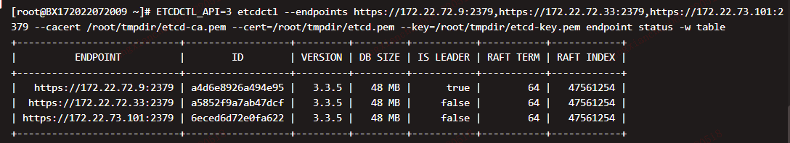

# etcd服务部署

## 一、单节点部署

## 二、集群部署

## 三、集群扩容

### 1.备份etcd数据

1.备份etcd数据

```shell
ETCD_API=3 etcdctl  \
--endpoints http://172.22.72.9:2379 \
--cacert=/etc/etcd/ssl/etcd-ca.pem \
--cert=/etc/etcd/ssl/etcd.pem \
--key=/etc/etcd/ssl/etcd-key.pem \
sanpshot save bakdata-20220412.db
```

2.恢复etcd数据

```shell
ETCD_API=3 etcdctl sanpshot restore bakdata-20220412.db --data-dir=/opt/data.etcd/etcd --wal-dir=/opt/data.etcd/wal
```

3.扩容
3.1 增加member
执行一下命令增加一个member,etcd02是要添加节点的名称，--peer-urls指定了

```bash
ETCD_API=3 etcdctl \
--endpoints https://172.22.72.9:2379 \
--cacert=/etc/etcd/ssl/etcd-ca.pem \
--cert=/etc/etcd/ssl/etcd.pem \
--key=/etc/etcd/ssl/etcd-key.pem \
member add etcd02 --peer-urls= https://172.22.72.33:2380
```

增加节点的命令执行之后，会在shell窗口返回一下信息

```bash
ETCD_NAME="etcd02"
ETCD_INITIAL_CLUSTER="etcd01=https://172.22.72.9:2380,etcd02=https://172.22.72.33:2380"
ETCS_INITIAL_ADVERTISE_PEER_URLS="https://172.22.72.33:2380"
ETCD_INITIAL_CLUSTER_STATE="existing"
```

创建etcd02启动脚本

```bash
# etcd-start.sh
export ETCD_BIN=/root/bin/etcd
export ETCD_NAME=etcd02
/opt/data/centos-7-51/kubernetes-study/dev-component/imagesexport ETCD_DATA_DIR=/opt/data/etcd
export ETCD_SNAPSHOT_COUNT=100
export ETCD_HEARTBEAT_INTERVAL=100
export ETCD_ELECTION_TIMEOUT=1000
export ETCD_LISTEN_PEER_URLS=https://172.22.72.33:2380
export ETCD_LISTEN_CLIENT_URLS=https://172.22.72.33:2379
export ETCD_MAX_SNAPSHOTS=5
export ETCD_MAX_WALS=5
export ETCS_INITIAL_ADVERTISE_PEER_URLS="https://172.22.72.33:2380"
export ETCD_INITIAL_CLUSTER="etcd01=https://172.22.72.9:2380,etcd02=https://172.22.72.33:2380"
export ETCD_INITIAL_CLUSTER_STATE="existing"
export ETCD_INITIAL_CLUSTER_TOKEN=etcd-cluster
export ETCD_ADVERTISE_CLIENT_URLS=https://172.22.72.33:2379
export ETCD_CERT_FILE=/etc/etcd/ssl/etcd.pem
export ETCD_KEY_FILE=/etc/etcd/ssl/etcd-key.pem
export ETCD_CLIENT_CERT_AUTH=true
export ETCD_TRUSTED_CA_FILE=/etc/etcd/ssl/etcd-ca.pem
export ETCD_AUTO_TLS=true
export ETCD_PEER_CERT_FILE=/etc/etcd/ssl/etcd.pem
export ETCD_PEER_KEY_FILE=/etc/etcd/ssl/etcd-key.pem
export ETCD_PEER_CLIENT_CERT_AUTH=true
export ETCD_PEER_TRUSTED_CA_FILE=/etc/etcd/ssl/etcd-ca.pem
export ETCD_PEER_AUTO_TLS=true

/root/bin/etcd \
--name=etcd02 \
--data-dir=/opt/data.etcd/etcd \
--listen-client-urls=https://172.22.72.33:2379 \
--advertise-client-urls=https://172.22.72.33:2379
```

3.2 执行一下命令增加etcd03节点

```bash
ETCD_API=3 etcdctl \
--endpoints https://172.22.72.9:2379 \
--cacert=/etc/etcd/ssl/etcd-ca.pem \
--cert=/etc/etcd/ssl/etcd.pem \
--key=/etc/etcd/ssl/etcd-key.pem \
member add etcd03 --peer-urls= https://172.22.73.101:2380
```

创建etcd03启动脚本

```bash
# etcd-start.sh
export ETCD_BIN=/root/bin/etcd
export ETCD_NAME=etcd03
export ETCD_DATA_DIR=/opt/data/etcd
export ETCD_SNAPSHOT_COUNT=100
export ETCD_HEARTBEAT_INTERVAL=100
export ETCD_ELECTION_TIMEOUT=1000
export ETCD_LISTEN_PEER_URLS=https://172.22.73.101:2380
export ETCD_LISTEN_CLIENT_URLS=https://172.22.73.101:2379
export ETCD_MAX_SNAPSHOTS=5
export ETCD_MAX_WALS=5
export ETCS_INITIAL_ADVERTISE_PEER_URLS="https://172.22.73.101:2380"
export ETCD_INITIAL_CLUSTER="etcd01=https://172.22.72.9:2380,etcd02=https://172.22.72.33:2380,etcd03=https://172.22.73.101:2379"
export ETCD_INITIAL_CLUSTER_STATE="existing"
export ETCD_INITIAL_CLUSTER_TOKEN=etcd-cluster
export ETCD_ADVERTISE_CLIENT_URLS=https://172.22.73.101:2379
export ETCD_CERT_FILE=/etc/etcd/ssl/etcd.pem
export ETCD_KEY_FILE=/etc/etcd/ssl/etcd-key.pem
export ETCD_CLIENT_CERT_AUTH=true
export ETCD_TRUSTED_CA_FILE=/etc/etcd/ssl/etcd-ca.pem
export ETCD_AUTO_TLS=true
export ETCD_PEER_CERT_FILE=/etc/etcd/ssl/etcd.pem
export ETCD_PEER_KEY_FILE=/etc/etcd/ssl/etcd-key.pem
export ETCD_PEER_CLIENT_CERT_AUTH=true
export ETCD_PEER_TRUSTED_CA_FILE=/etc/etcd/ssl/etcd-ca.pem
export ETCD_PEER_AUTO_TLS=true

/root/bin/etcd \
--name=etcd02 \
--data-dir=/opt/data.etcd/etcd \
--listen-client-urls=https://172.22.73.101:2379 \
--advertise-client-urls=https://172.22.73.101:2379
```

3.3 查看集群状态

```bash
ETCD_API=3 etcdctl \
--endpoints https://172.22.72.9:2379,https://172.22.72.33:2379,https://172.22.73.101:2379 \
--cacert=/etc/etcd/ssl/etcd-ca.pem \
--cert=/etc/etcd/ssl/etcd.pem \
--key=/etc/etcd/ssl/etcd-key.pem \
endpoint status -w table
```



