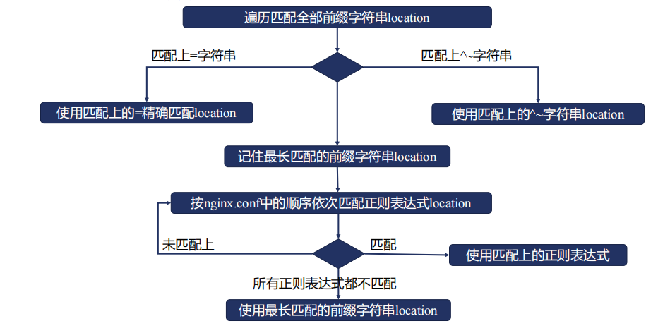

<!-- @import "[TOC]" {cmd="toc" depthFrom=1 depthTo=6 orderedList=false} -->

<!-- code_chunk_output -->

- [Nginx](#nginx)
  - [面试题](#面试题)
    - [nginx有哪些优点？](#nginx有哪些优点)
    - [什么叫CDN服务](#什么叫cdn服务)
    - [Nginx虚拟主机怎么配置](#nginx虚拟主机怎么配置)
    - [location的作用是什么？](#location的作用是什么)
  - [rewrite模块](#rewrite模块)
    - [rewrite行为记入error日志](#rewrite行为记入error日志)
    - [rewrite模块if指令](#rewrite模块if指令)
  - [location模块](#location模块)
  - [如何限制客户端的并发连接数](#如何限制客户端的并发连接数)

<!-- /code_chunk_output -->

# Nginx

## 面试题

### nginx有哪些优点？

### 什么叫CDN服务

CDN，即内容分发网络

其目的是，通过在现有的internet中增加一层新的网络框架，将网站的内容发布到最接近用户的网络边缘，使用户可以就近取得所需的内容，提高用户访问网站的速度。

### Nginx虚拟主机怎么配置

1. 基于域名的虚拟主机，通过域名来区分虚拟主机
2. 基于端口的虚拟主机，通过端口来区分虚拟主机
3. 基于IP的虚拟主机


### location的作用是什么？

## rewrite模块

rewrite指令

```nginx
    Syntax: rewrite regex replacement [flag];
    Default: --;
    Context: server, location, if;
```

+ 将regex指定的url替换成replacement这个新的url
  --可以使用正则表达式及变量提取

+ 当replacement以 http:// 或者 https:// 或者 $schema 开头，则直接返回302重定向
+ 替换后的url根据flag指定的方式进行处理
    --last： 用replacement这个URI进行新的location匹配，即在当前server模块中，匹配新的location
    --break：break指令停止当前脚本指令的执行，等价与独立的break指令
    --redirect：返回302重定向,临时重定向
    --permanent：返回301重定向，永久重定向

配置指令

```bash
[root@hdss7-200 root]# tree
.
├── first
│   └── 1.txt
├── second
│   └── 2.txt
└── third
    └── 3.txt

[root@hdss7-200 conf.d]# cat rewrite.wxc.tech.conf
server {
    listen 80;
    server_name rewrite.wxc.tech;

    access_log /opt/data/centos-7-51/nginx-study/logs/rewrite.wxc.tech_access.log main;
    error_log /opt/data/centos-7-51/nginx-study/logs/rewrite.wxc.tech_error.log;

    root /opt/data/centos-7-51/nginx-study/root;
    location /first {
        rewrite /first(.*) /second$1 last;
        # root /opt/data/centos-7-51/nginx-study/root;
        return 200 'first!';
    }

    location /second {
        rewrite /second(.*) /third$1 break;
        return 200 'second!';
    }

    location /third {
        root /opt/data/centos-7-51/nginx-study/root;
        return 200 'third!';
    }
    location /demo {
        root /opt/data/centos-7-51/nginx-study/root;
    }
}

```

执行请求

```bash


[root@hdss7-200 conf.d]# curl http://10.4.7.200/first/1.txt -H Host:rewrite.wxc.tech  # 请求1
third directory 1.txt
[root@hdss7-200 conf.d]# curl http://10.4.7.200/second/1.txt -H Host:rewrite.wxc.tech # 请求2
third directory 1.txt
[root@hdss7-200 conf.d]# curl http://10.4.7.200/third/1.txt -H Host:rewrite.wxc.tech  # 请求3
third!
[root@hdss7-200 conf.d]#
```

**结果分析:**

nginx对请求1处理过程：

1. 匹配到location /first, rewrite指令将URL重写为/second/1.txt，last表示继续匹配新的location，该location模块后边的指令将不在执行。
2. URL /second/1.txt匹配到 location /second/, rewrite指令将URL重写为/third/1.txt, break表示停止当前脚本执行，即在此处处理URL /third/1.txt，根据静态文件路径，返回third/1.txt文件的内容，该location模块后边的指令将不在执行。

nginx对请求2处理过程：

1. URL /second/1.txt匹配到 location /second/, rewrite指令将URL重写为/third/1.txt, break表示停止当前脚本执行，即在此处处理URL /third/1.txt，根据静态文件路径，返回third/1.txt文件的内容，该location模块后边的指令将不在执行。

nginx对请求3处理过程：

1. URL /third/1.txt匹配到 location /third/，root指令是一个赋值指令，接下来是return指令，直接返回状态码和字符串内容。return指令是rewrite
阶段的指令，静态文件解析没有机会执行

```bash
location /redirect1 {
    rewrite /redirect1(.*) $1 permanent;
}

location /redirect2 {
    rewrite /redirect2(.*) $1 redirect;
}

location /redirect3 {
    rewrite /redirect3(.*) http://rewrite.wxc.tech$1;
}

location /redirect4 {
    rewrite /redirect4(.*) http://rewrite.wxc.tech$1 permanent;
}
```

### rewrite行为记入error日志

```nginx
    Syntax: rewrite_log on | off;
    Default: rewrite_log off;
    Context: http, server, location, if;
```

### rewrite模块if指令

```nginx
    Syntax: if(condition) {...};
    Default: --;
    Context: server, location;

    条件condition为真，则执行大括号内的指令；遵循值指令的继承规则
```

1. 检查变量为空或者为0，直接使用
2. 将变量与字符串匹配，直接使用=或者!=
3. 将变量与正则表达式做匹配
    + 大小写敏感，~ 或者 !~
    + 大小写不敏感， ~* 或者 !~*

4. 检查文件是否存在，使用-f或者!-f
5. 检查目录是否存在，使用-d或者!-d
6. 检查文件，目录，软连接是否存在，使用-e或者!-e
7. 检查文件是否为可执行文件，使用-x或者!-x

配置示例

```nginx
if ($http_user_agent ~ MSIE) {
    rewrite ^(.*)$ /msie/$1 break;
}

if ($http_cookie ~* "id=([^;]+)(?:;|$)") {
    set $id $1;
}

if ($request_method = POST) {
    return 405;
}

if ($slow) {
    limit_rate 10k;
}

if ($invalid_referer) {
    return 403;
}
```

## location模块

```nginx
    Syntax: 
        location [=|~|~*|^~] uri {...}
        location @name {...}
    Default: --
    Context: server, location

    Syntax: merge_slashes on|off；
    Default： merge_slashes on;
    Context: http， server
```

location匹配规则：仅匹配URI，忽略参数


location匹配顺序


location匹配流程图


**匹配优先级：**

**精确匹配** > **停止正则的最长前缀匹配** > **按顺序进行正则匹配** > **普通的最长前缀匹配**

配置示例

```nginx

# 正则匹配
location ~ /Test1/$ {
    return 200 'first regular expresstions match!';
}

# 正则匹配，忽略大小写
location ~* /Test1/(\w+)$ {
    return 200 'longest regular expressions match!';
}

# 前缀匹配，匹配到的话，不再进行正则匹配
location ^~ /Test1/ {
    return 200 'stop regular expressions match'; 
}

# 前缀匹配
# /和/Test1和/Test1/Test2都是前缀匹配，都匹配到的话，优先选择最长的
location /Test1/Test2 {
    return 200 'longest prefix string match!';
}

# 前缀匹配
location /Test1 {
    return 200 'prefix string match!';
}

# 前缀匹配
location / {
    return 200 'prefix string match!';
}

# 精确匹配
location = /Test1 {
    return 200 'exact match!';
}
```

一下url会返回什么内容？

|      URL        |           Response                         |   Anylize        |
|-----------------|--------------------------------------------|------------------|
| /Test1          |     exact match!                           |  精确匹配
| /Test1/         |     stop regular expressions match         |  最长前缀匹配是非正则匹配
| /Test1/Test2    |     longest regular expressions match!     |  最长前缀匹配没有^~标记，需要先正则匹配
| /Test1/Test2/   |     longest prefix string match!           |  最长前缀匹配没有^~标记，需要先正则匹配，但是正则匹配不满足要求，匹配到最长前缀
| /test1/Test2    |     longest regular expressions match!     |  只有/路径符合前缀匹配，然后正则匹配到 ~* /Test1/(\w+)$

## 如何限制客户端的并发连接数

