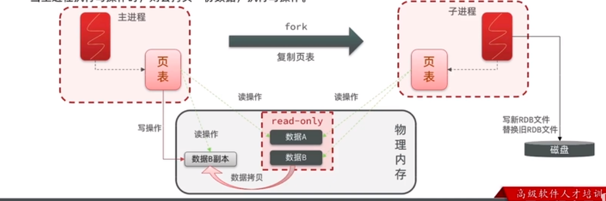

# 常见面试题

## 1. redis中的RDB备份方式

bgsave开始时，会fork主机进程得到子进程，子进程共享主进程的内存数据，完成fork后读取内存数据并写入RDB文件.
fork采用的是copy-on-write技术：

+ 当主进程执行读操作时，访问共享数据；
+ 当主进程执行写操作时，则会拷贝一份数据，执行写操作。

_根据异步备份流程分析可得，当rdb子进程备份数据较慢时，整个redis服务所占用的内存可以达到所有数据的2倍，部署redis时，应该预留一部分内存给备份时使用。_



RDB**触发条件**

+ 手动触发：save/bgsave
+ 自动触发: 满足redis配置文件中的自动触发条件RDB
+ 自动触发：每次关闭redis也会自动触发RDB
+ 自动触发：执行flushall命令也会自动触发RDB

redis**配置文件**

```bash
save 60 1000  # 每60秒内有1000次修改触发RDB
```

RDB**触发命令**

```bash
save        # save命令会阻塞redis服务的正常进程,直到RDB创建文件结束
bgsave      # bgsave会fork一个子进程,父进程继续处理了请求,不会影响redis服务,但是此时会拒绝客户端发送的save或bgsave命令,避免重复执行,竞争资源
flushall    # 用于清空整个redis服务器的数据
```

## 2. redis中的AOF备份方式

## 3. 当内存满了之后，redis的删除策略
